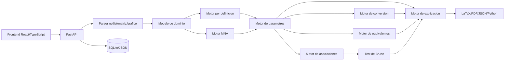

# Diseno de software educativo-tecnico para resolver cuadripolos

Fuente academica tomada como referencia:

- `CUADRIPOLOS/APUNTE DE CUADRIPOLOS.pdf`
- `CUADRIPOLOS/Guia de ejercicios de cuadripolos.pdf`
- `CUADRIPOLOS/Ejercicios de ejemplo de cuadripolos.pdf`

Este documento no programa la aplicacion todavia. Define el producto, la arquitectura, los datos, los algoritmos y los casos de prueba para que luego pueda implementarse por modulos.

## 1. Criterio academico base

El software debe seguir el enfoque de Teoria de Circuitos II usado en los apuntes:

- Tratar al circuito como una caja negra de dos puertos con bornes `1`, `1'`, `2`, `2'`.
- Mostrar siempre las referencias de `V1`, `V2`, `I1`, `I2`.
- Considerar `I1` e `I2` entrando al cuadripolo.
- Para matriz principal o transmision usar la convencion del apunte:

```text
V1 = A V2 - B I2
I1 = C V2 - D I2

Gamma = [[A, B],
         [C, D]]
```

La explicacion debe parecerse a los ejemplos de practica: condicion aplicada, ecuaciones, sustitucion numerica o simbolica, matriz final, verificacion de reciprocidad/simetria y conversion si corresponde.

## 2. Especificacion funcional

### 2.1 Modos de entrada

1. Modo grafico:
   - Editor visual de dos puertos.
   - Bornes fijos `1`, `1'`, `2`, `2'`.
   - Componentes: resistencias, impedancias genericas, capacitores, inductores, fuentes independientes y dependientes.
   - Valores numericos, complejos o simbolicos: `R`, `j*w*L`, `1/(j*w*C)`, `s*L`, `1/(s*C)`.

2. Modo netlist:

```text
R1 1 n1 30
R2 n1 n2 50
R3 n2 2 10
R4 n1 0 40
R5 n2 0 20
```

3. Modo matriz:
   - Ingreso directo de matrices `Z`, `Y`, `h`, `g` o `Gamma`.
   - Operaciones disponibles: conversion, equivalente, asociacion y verificacion.

### 2.2 Salidas

- Resolucion en pantalla.
- Circuito original y circuito equivalente.
- Matrices con formato matematico.
- Desarrollo paso a paso.
- Exportacion a PDF.
- Exportacion a LaTeX.
- Imagen del circuito.
- JSON del circuito.
- Codigo Python/SymPy reproducible.

### 2.3 Familias de parametros

Parametros `Z`:

```text
V1 = z11 I1 + z12 I2
V2 = z21 I1 + z22 I2
```

Parametros `Y`:

```text
I1 = y11 V1 + y12 V2
I2 = y21 V1 + y22 V2
```

Parametros `h`:

```text
V1 = h11 I1 + h12 V2
I2 = h21 I1 + h22 V2
```

Parametros `g`:

```text
I1 = g11 V1 + g12 I2
V2 = g21 V1 + g22 I2
```

Parametros principales o transmision:

```text
V1 = A V2 - B I2
I1 = C V2 - D I2
```

## 3. Arquitectura del sistema

### 3.1 Vista general



### 3.2 Modulos

- `frontend`: editor grafico, paneles, render de matrices, paso a paso.
- `api`: endpoints para resolver, convertir, asociar, exportar y validar ejercicios.
- `domain`: entidades puras de circuitos, puertos, componentes, matrices y pasos.
- `netlist_parser`: parser estilo SPICE reducido.
- `mna_engine`: analisis nodal modificado numerico/simbolico.
- `definition_engine`: resolucion por definicion de parametros.
- `parameter_engine`: extraccion de `Z`, `Y`, `h`, `g`, `Gamma`.
- `conversion_engine`: conversion entre familias con chequeos de existencia.
- `association_engine`: cascada, serie-serie, paralelo-paralelo, serie-paralelo, paralelo-serie.
- `brune_engine`: ensayos de Brune por tipo de interconexion.
- `equivalent_engine`: equivalentes `T`, `pi`, `X`, impedancia caracteristica.
- `explanation_engine`: genera narrativa didactica tipo apunte.
- `exercise_validator`: fixtures tomados de los PDFs.
- `export_service`: LaTeX, PDF, imagen, JSON y Python/SymPy.

## 4. Modelo de datos

```ts
type Node = {
  id: string;
  label: string;
  isReference: boolean;
};

type Port = {
  id: "P1" | "P2";
  positiveNode: string;
  negativeNode: string;
  voltageLabel: "V1" | "V2";
  currentLabel: "I1" | "I2";
  currentConvention: "entering_positive_terminal";
};

type Component = {
  id: string;
  kind: "R" | "Z" | "C" | "L" | "V" | "I" | "VCVS" | "VCCS" | "CCVS" | "CCCS";
  nodeA: string;
  nodeB: string;
  value: string;
  unit?: string;
  control?: {
    nodeC?: string;
    nodeD?: string;
    sourceId?: string;
  };
};

type TwoPort = {
  id: string;
  name: string;
  nodes: Node[];
  ports: [Port, Port];
  components: Component[];
  assumptions: string[];
};

type ParameterMatrix = {
  family: "Z" | "Y" | "h" | "g" | "Gamma";
  values: [[Expr, Expr], [Expr, Expr]];
  convention: string;
  units: [[string, string], [string, string]];
  determinant?: Expr;
  existenceConditions: string[];
};

type Association = {
  id: string;
  type: "cascade" | "series_series" | "parallel_parallel" | "series_parallel" | "parallel_series";
  twoPorts: string[];
  preferredFamily: "Gamma" | "Z" | "Y" | "h" | "g";
  requiresBrune: boolean;
};

type SolutionStep = {
  id: string;
  title: string;
  explanation: string;
  equations: string[];
  result?: string;
  warnings: string[];
};

type Exercise = {
  id: string;
  sourcePdf: string;
  sourceProblem: string;
  statement: string;
  inputMode: "netlist" | "matrix" | "graphic";
  expectedResults: ParameterMatrix[];
  tolerance?: number;
};
```

## 5. Algoritmos principales

### 5.1 Validar que el circuito sea un cuadripolo

```text
validate_two_port(circuit):
  require exactly two ports
  require each port has positive and negative node
  require no port terminal is undefined
  require at least one path between input side and output side if solving transfer params
  check floating subcircuits
  check unsupported ideal-source loops or current-source cutsets
  return diagnostics
```

### 5.2 Armar matriz MNA

```text
build_mna(circuit):
  map non-reference nodes to voltage unknowns
  add extra current unknowns for voltage sources and controlled voltage sources
  initialize A*x = b
  for each passive admittance Y between a,b:
    stamp +Y at aa and bb
    stamp -Y at ab and ba
  for each current source:
    stamp current injection into b
  for each voltage source:
    add source current unknown
    add voltage constraint Va - Vb = value
  for controlled sources:
    stamp according to source type
  return symbolic or numeric linear system
```

### 5.3 Parametros por definicion

El motor debe generar el mismo tipo de solucion que los ejemplos.

```text
solve_Z(circuit):
  trial 1: impose I1 = 1, I2 = 0  # salida abierta
           solve V1,V2
           z11 = V1/I1
           z21 = V2/I1
  trial 2: impose I1 = 0, I2 = 1  # entrada abierta
           solve V1,V2
           z12 = V1/I2
           z22 = V2/I2
  return Z and steps
```

```text
solve_Y(circuit):
  trial 1: impose V1 = 1, V2 = 0  # salida en corto
           solve I1,I2
           y11 = I1/V1
           y21 = I2/V1
  trial 2: impose V1 = 0, V2 = 1  # entrada en corto
           solve I1,I2
           y12 = I1/V2
           y22 = I2/V2
  return Y and steps
```

```text
solve_h(circuit):
  trial 1: impose I1 = 1, V2 = 0
           h11 = V1/I1
           h21 = I2/I1
  trial 2: impose I1 = 0, V2 = 1
           h12 = V1/V2
           h22 = I2/V2
  return h and steps
```

```text
solve_g(circuit):
  trial 1: impose V1 = 1, I2 = 0
           g11 = I1/V1
           g21 = V2/V1
  trial 2: impose V1 = 0, I2 = 1
           g12 = I1/I2
           g22 = V2/I2
  return g and steps
```

```text
solve_Gamma(circuit):
  trial 1: impose V2 = 1, I2 = 0
           A = V1/V2
           C = I1/V2
  trial 2: impose V2 = 0, I2 = 1
           B = -V1/I2
           D = -I1/I2
  return Gamma and steps
```

### 5.4 Conversiones principales

Usar algebra simbolica exacta cuando sea posible. Cada conversion debe devolver tambien condiciones.

Desde `Z`:

```text
DeltaZ = z11*z22 - z12*z21

Y = (1/DeltaZ) * [[ z22, -z12],
                  [-z21,  z11]]
condition: DeltaZ != 0

h = [[DeltaZ/z22, z12/z22],
     [-z21/z22,   1/z22]]
condition: z22 != 0

g = [[1/z11,     -z12/z11],
     [z21/z11, DeltaZ/z11]]
condition: z11 != 0

Gamma = [[z11/z21, DeltaZ/z21],
         [1/z21,   z22/z21]]
condition: z21 != 0
```

Desde `Y`:

```text
DeltaY = y11*y22 - y12*y21

Z = (1/DeltaY) * [[ y22, -y12],
                  [-y21,  y11]]
condition: DeltaY != 0

Gamma = [[-y22/y21, -1/y21],
         [-DeltaY/y21, -y11/y21]]
condition: y21 != 0
```

El conversor debe tener tabla completa, pero internamente puede convertir a una representacion canonica (`Z` o `Y`) y desde alli a la familia pedida, siempre conservando las condiciones de existencia.

### 5.5 Reciprocidad y simetria

```text
is_reciprocal(Z): z12 == z21
is_reciprocal(Y): y12 == y21
is_reciprocal(h): h12 == -h21
is_reciprocal(g): g12 == -g21
is_reciprocal(Gamma): A*D - B*C == 1

is_symmetric(Z): z11 == z22
is_symmetric(Y): y11 == y22
is_symmetric(Gamma): A == D
```

Para `h` y `g`, en cuadripolos simetricos del apunte se verifica una condicion de determinante igual a `1` segun la convencion usada. El software debe mostrar esa verificacion solo cuando la familia exista y la convencion sea la misma.

### 5.6 Equivalente T

Para un cuadripolo reciproco expresado en `Z`:

```text
Za = z11 - z12
Zb = z22 - z12
Zc = z12
```

Debe advertir si `z12 != z21`, porque el T pasivo simple no representa un cuadripolo no reciproco.

### 5.7 Equivalente pi

Para un cuadripolo reciproco expresado en `Y`:

```text
Ya = y11 + y12
Yb = y22 + y12
Yc = -y12

Za = 1/Ya
Zb = 1/Yb
Zc = 1/Yc
```

Debe verificar que los denominadores no sean cero.

### 5.8 Equivalente X simetrico

Aplicar solo si el cuadripolo es reciproco y simetrico. El motor debe:

```text
to_lattice_X(matrix):
  require reciprocal
  require symmetric
  convert to convenient family
  solve symbolic equations of lattice symmetric X
  return arm impedances and conditions
```

En la guia este caso aparece asociado al problema del cuadripolo `T` simetrico con impedancias complejas `Z1 = j5` y `Z2 = -j3`.

### 5.9 Impedancia caracteristica

Debe ofrecerse cuando el cuadripolo es simetrico.

```text
if symmetric and Z exists:
  Z0 = sqrt(DeltaZ)
  where DeltaZ = z11*z22 - z12*z21
  also show image-parameter derivation if Gamma/image params are available
```

Nota de implementacion: el apunte desarrolla impedancias imagen y luego impedancia caracteristica como caso simetrico. El software debe separar "impedancias imagen" de "impedancia caracteristica" para no mezclar conceptos.

### 5.10 Asociaciones

Tabla didactica tomada de los ejemplos:

```text
Conexion              Familia conveniente    Operacion
Cascada               Gamma                  producto matricial ordenado
Serie-Serie           Z                      suma de matrices
Paralelo-Paralelo     Y                      suma de matrices
Serie-Paralelo        h                      suma de matrices
Paralelo-Serie        g                      suma de matrices
```

Algoritmo:

```text
solve_association(association):
  detect type from topology or user selection
  preferred = lookup_preferred_family(type)
  convert each two-port to preferred
  if type is cascade:
    result = Gamma1 * Gamma2 * ... * GammaN
  else:
    brune = run_brune_tests(association)
    if brune.pass:
      result = M1 + M2 + ... + MN
    else:
      result = solve_full_interconnected_network_by_MNA()
      warn "No corresponde sumar matrices individuales"
  return result, explanation, warnings
```

### 5.11 Test de Brune

El software debe implementar Brune como herramienta explicativa, no solo como comparacion numerica.

```text
run_brune_tests(association):
  fixture = brune_fixture_by_type[association.type]
  results = []
  for test in fixture.tests:  # dos ensayos
    network = build_interconnected_network(association)
    apply_excitation(test.source)
    apply_termination(test.termination)
    solve network
    interference = evaluate(test.interference_probe)
    results.append(simplify(interference) == 0)
  return pass if all results are true
```

Ademas, para robustez tecnica:

```text
verify_by_full_solution(association):
  direct = matrix_sum_or_product_if_allowed()
  full = solve_full_interconnected_network_by_MNA()
  compare simplify(full - direct)
```

La explicacion debe decir: "La suma directa solo es valida si la interconexion no modifica los parametros individuales". Esto aparece explicitamente en la logica de asociaciones del apunte.

### 5.12 Generacion de explicacion paso a paso

```text
generate_solution(problem):
  add original circuit diagram
  add selected family and equations
  for each parameter trial:
    show imposed condition
    show equivalent circuit condition: open or short port
    show equations generated
    show simplifications
    show parameter value
  build matrix
  add units
  verify reciprocity/symmetry
  if conversion requested:
    show determinant and existence condition
    show substituted matrix
  if association requested:
    show selected family by topology
    show Brune tests if required
    show final result
  add warnings about signs and conventions
```

## 6. Propuesta de interfaz

### 6.1 Layout

- Barra superior: proyecto, modo de entrada, resolver, exportar.
- Panel izquierdo: componentes y fuentes.
- Area central: editor grafico con grilla, bornes y sentidos de `V1`, `V2`, `I1`, `I2`.
- Panel derecho: propiedades del componente, valor simbolico, unidades, nombre.
- Panel inferior: errores, advertencias y log de validacion.
- Vista de resultados: pestanas `Circuito`, `Parametros`, `Paso a paso`, `Conversiones`, `Asociaciones`, `Exportar`.

### 6.2 Flujos principales

1. Resolver desde netlist:
   - Usuario pega netlist.
   - Sistema detecta puertos.
   - Usuario elige familia.
   - Sistema resuelve y muestra pasos.

2. Convertir matriz:
   - Usuario ingresa `Z`, `Y`, `h`, `g` o `Gamma`.
   - Sistema valida determinantes.
   - Sistema muestra conversion y condiciones.

3. Asociar cuadripolos:
   - Usuario carga dos o mas cuadripolos.
   - Sistema detecta o pide tipo de asociacion.
   - Sistema sugiere familia conveniente.
   - Sistema ejecuta Brune si corresponde.
   - Sistema muestra resultado.

4. Obtener equivalente:
   - Usuario carga matriz o circuito.
   - Sistema verifica reciprocidad/simetria.
   - Sistema devuelve `T`, `pi`, `X` o `Z0` si existen.

## 7. Roadmap

### MVP 1: netlist y calculo Z/Y

- Parser de netlist resistivo e impedancias simbolicas.
- MNA basico.
- Calculo por definicion de `Z` e `Y`.
- Explicacion paso a paso.
- Validacion con Ejercicio de ejemplo 1.

### MVP 2: conversiones entre matrices

- Conversion `Z <-> Y`.
- Conversion `Z -> h`, `Z -> g`, `Z -> Gamma`.
- Chequeo de determinantes y divisiones por cero.
- Validacion con Ejercicio de ejemplo 2 y conversion `Z -> Gamma` del ejemplo 4.

### MVP 3: asociaciones de cuadripolos

- Cascada con `Gamma`.
- Serie-Serie con `Z`.
- Paralelo-Paralelo con `Y`.
- Serie-Paralelo con `h`.
- Paralelo-Serie con `g`.
- Primera version de Brune.
- Validacion con Ejercicio de ejemplo 4 y problemas 8 a 13 de la guia.

### MVP 4: editor grafico

- Editor SVG con grilla.
- Drag and drop de componentes.
- Conexion por nodos.
- Exportacion/importacion JSON.
- Render de circuitos equivalentes.

### MVP 5: explicacion avanzada y exportacion

- Generador LaTeX.
- Exportacion PDF.
- Exportacion imagen.
- Codigo Python/SymPy reproducible.
- Base de problemas resueltos.
- Modo estudio con ocultar/mostrar pasos.

## 8. Casos de prueba basados en los PDFs

### 8.1 Ejercicios de ejemplo de cuadripolos

1. Ejercicio de ejemplo 1:
   - Entrada: red resistiva del ejemplo.
   - Pedidos: `Z` e `Y`.
   - Esperado:

```text
Z = [[55.45, 7.27],
     [ 7.27, 26.36]]

Y = [[ 0.018,  -0.0051],
     [-0.0051,  0.039 ]]
```

   - Verificacion: `z12 = z21` y `y12 = y21`, por lo tanto reciproco.

2. Ejercicio de ejemplo 2:
   - Entrada: matriz `Z` del ejercicio 1.
   - Pedido: conversion `Z -> Y`.
   - Esperado: determinante `DeltaZ = 1408.8` y matriz `Y` coincidente con el ejercicio 1.

3. Ejercicio de ejemplo 3:
   - Entrada: matriz `Z` del ejercicio 1.
   - Pedido: equivalente `T`.
   - Esperado:

```text
Za = z11 - z12 = 48.18 ohm
Zb = z22 - z12 = 19.09 ohm
Zc = z12       =  7.27 ohm
```

4. Ejercicio de ejemplo 4:
   - Entrada: asociacion serie-serie.
   - Cuadripolo A: `Z` del ejercicio 1.
   - Cuadripolo B:

```text
ZB = [[12, 8],
      [ 8, 12]]
```

   - Esperado:

```text
Zeq = [[67.45, 15.27],
       [15.27, 38.36]]

Gamma = [[4.41, 154.17],
         [0.065, 2.51]]
```

### 8.2 Guia de ejercicios de cuadripolos

- Problema 1: parametros de admitancia de dos cuadripolos.
- Problema 2: parametros de impedancia de un cuadripolo.
- Problema 3: cuadripolo `T` simetrico con `Z1 = j5` y `Z2 = -j3`; pedir `Z`, `Gamma`, equivalente `pi`, equivalente `X` simetrico e impedancia caracteristica.
- Problema 4: parametros de transmision de cuadripolos tipicos, primero por ecuaciones y luego por tabla.
- Problema 5: matriz dada; obtener equivalentes `T` y `pi`.
- Problema 6: operacional realimentado como asociacion serie-paralelo; obtener parametros `h`, ganancia de tension y demostrar Brune.
- Problemas 8 y 9: asociaciones que piden `Y` o `Z`.
- Problemas 10 y 11: asociaciones que piden `Gamma`, `Y` y `Z`.
- Problemas 12 y 13: elegir la familia mas conveniente para el resultante.
- Problema 14: parametros `Z`.

Cada caso debe guardarse como fixture:

```json
{
  "id": "ejemplo_1_z_y",
  "source": "Ejercicios de ejemplo de cuadripolos.pdf",
  "input": "...",
  "requests": ["Z", "Y"],
  "expected": {},
  "tolerance": 0.01
}
```

## 9. Stack recomendado

- Frontend: React + TypeScript.
- Editor de circuito: SVG custom con pan/zoom; opcional React Flow solo para grafo logico, no para simbolos electricos finales.
- Estado frontend: Zustand.
- Matematica en UI: KaTeX o MathJax.
- Backend: Python + FastAPI.
- Validacion de modelos: Pydantic.
- Algebra simbolica: SymPy.
- Calculo numerico: NumPy.
- Grafos: NetworkX o estructura propia simple.
- Persistencia: JSON para ejercicios y SQLite para proyectos/resultados.
- Exportacion PDF: LaTeX + tectonic o WeasyPrint segun disponibilidad.
- Testing: pytest para motor, Playwright para UI.

Recomendacion practica: empezar con backend Python y una UI minima. El riesgo tecnico fuerte esta en el motor simbolico y las convenciones, no en el drag and drop.

## 10. Riesgos tecnicos y mitigaciones

- Convencion de signos de `Gamma`: guardar la convencion en cada matriz y mostrarla siempre. Validar con el ejemplo 4, donde `Gamma = [[z11/z21, DeltaZ/z21], [1/z21, z22/z21]]`.
- Matrices singulares: toda conversion debe devolver condicion de existencia y explicacion.
- Circuitos flotantes: el validador debe detectar subredes sin referencia o puertos mal definidos antes de resolver.
- Fuentes ideales y dependientes: MNA debe soportarlas por etapas; no mezclarlas todas en MVP 1.
- Expresiones simbolicas grandes: usar simplificacion controlada, no simplificar todo globalmente.
- Brune: implementarlo como fixtures de ensayo por tipo de conexion y compararlo con solucion completa por MNA.
- Editor grafico: separar esquema visual de modelo electrico; el circuito real debe ser el grafo/nodos, no las coordenadas.
- Pedagogia: el motor no debe devolver solo matrices; cada algoritmo debe emitir `SolutionStep`.
- Validacion contra PDFs: cargar primero los ejemplos resueltos, porque tienen resultados numericos claros.

## 11. Definicion de "listo" para implementar

El sistema esta listo para pasar a implementacion cuando existan:

- Fixtures JSON de los cuatro ejercicios de ejemplo.
- Tabla de conversiones completa con condiciones.
- Especificacion de netlist aceptado.
- Contrato API para resolver, convertir, asociar y exportar.
- Plantillas de explicacion por familia.
- Pruebas unitarias de `Z`, `Y`, `Z -> Y`, `Z -> Gamma`, equivalente `T` y serie-serie.
